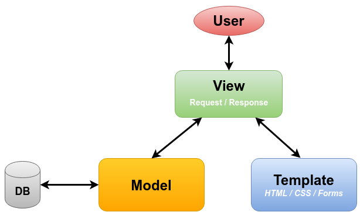

# Архитектура Django

Django следует модели MVT (Model-View-Template), 
которая является вариацией MVC (Model-View-Controller). 
Вот упрощенная архитектура, включающая основные компоненты: User, View, Form, Model, Template и DB.

---

## Диаграмма архитектуры

+-------------------+
|      Browser      |
+-------------------+
          |
          v
+-------------------+
|       URLs        |
+-------------------+
          |
          v
+-------------------+
|       Views       |
+-------------------+
          |
          v
+-------------------+
|       Forms       |
+-------------------+
          |
          v
+-------------------+
|      Models       |
+-------------------+
          |
          v
+-------------------+
|     Database      |
+-------------------+
          |
          v
+-------------------+
|     Templates     |
+-------------------+
          |
          v
+-------------------+
|      Static       |
|      Media        |
+-------------------+

---

## Описание взаимодействия

1. **Browser (Браузер)**:

Пользователь отправляет запрос через браузер.

2. **URLs (Маршруты)**:
   - Запрос обрабатывается URL-конфигурацией, которая направляет его к соответствующему виду.

3. **Views (Виды)**:

    - Виды обрабатывают запрос, могут использовать формы для валидации данных, взаимодействуют с моделями и готовят данные для отображения.

4. **Forms (Формы)**:

   - Формы используются для обработки и валидации пользовательского ввода.

5. **Models (Модели)**:

   - Модели предоставляют доступ к данным в базе данных.

6. **Database (База данных)**:

   - Хранит данные приложения.

7. **Templates (Шаблоны)**:

   - Шаблоны отображают данные, подготовленные видами.

8. **Static & Media (Статические и медиа файлы)**:

   - Предоставляют статические ресурсы и загружаемые пользователем файлы.

---

Эта диаграмма и описание помогают понять, как различные компоненты Django 
взаимодействуют друг с другом в процессе обработки запроса и отображения ответа пользователю.

---

  

---

#### [Architecture.md](Architecture.md)
